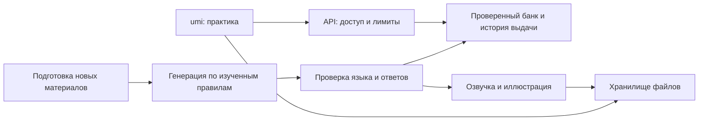

# ИИ, аудирование и ежедневная тема в umi

План от 7 октября 2026. Это проект внедрения: API ещё не подключены, платные запросы не выполнялись. Цены проверены по официальным источникам; доступ к выбранным моделям проверяется в конкретном API-проекте перед запуском.

## Что предлагаю запустить первым

Ежедневная короткая история с вопросами на понимание — хороший первый формат. Она даёт цель чтению, подходит для аудирования и позволяет принимать ответы своими словами. Одна история становится общим материалом для чтения, прослушивания и нескольких грамматических упражнений.

Порядок внедрения: **новые примеры и вопросы → тема дня → аудирование → иллюстрации → голосовые ответы**. Для первого выпуска достаточно текста, вопросов с выбором и короткого письменного ответа. Перевод и заполнение форм добавляем как дополнительные режимы того же материала.

## Модели

| Задача | Предложение | Почему |
|---|---|---|
| Японские истории, упражнения и языковая проверка | OpenAI `gpt-6.1-sol` | Начать с более сильной модели, измерить качество на японском и сохранить проверенный контент |
| Экономия после пилота | `gpt-6-luna` для простых заданий и предварительной проверки ответов | Значительно дешевле; переводить на неё только форматы, которые прошли ту же языковую проверку |
| Озвучка подготовленного сценария | Google Cloud Text-to-Speech, японские голоса Chirp 3 HD | Генерация из фиксированного текста, готовые японские голоса, отдельный сохраняемый аудиофайл |
| Новые иллюстрации | OpenAI `gpt-image-2` | Создавать собственные сцены заранее и использовать повторно |
| Голосовой ответ пользователя, позже | `gpt-4o-mini-transcribe` + текстовая оценка | Сначала получить расшифровку и дать её исправить; оценку смысла делать отдельно |

Выбор Sol для японского — рабочая гипотеза о качестве, а не доказанное сравнение на нашем банке. Перед массовой генерацией нужен пилот: 100–150 заданий разных уровней с проверкой человеком, хорошо владеющим японским. Проверяем естественность, смысл, однозначность вариантов, корректность стиля и соответствие изученной грамматике. Целевая планка: ни одной ошибки в правильных ответах; спорные задания не публикуются.

Официальные цены за миллион входных / выходных текстовых токенов: Sol — **$2 / $10**, Luna — **$0.10 / $0.50** для короткого контекста. Рассуждение и повторные генерации могут увеличивать выходной расход. [Sol](https://developers.openai.com/api/docs/models/gpt-6.1-sol), [Luna](https://developers.openai.com/api/docs/models/gpt-6-luna), [тарифы](https://developers.openai.com/api/docs/pricing).

Для нового приложения не закладываю старые `tts-1`, `tts-1-hd` и снимки `gpt-4o-mini-tts`: OpenAI объявляет их отключение **6 января 2027**, рекомендуя `gpt-realtime-2.1-mini`. Realtime можно отдельно сравнить на японском, если важен один поставщик; для фиксированных уроков сначала выбрал бы отдельный TTS. [Объявление об отключении](https://developers.openai.com/api/docs/deprecations).

Chirp 3 HD поддерживает японские голоса; официальная цена после бесплатного объёма — **$30 за миллион символов**, первый миллион в месяц указан как бесплатный. Пример голоса для пилота: `ja-JP-Chirp3-HD-Kore`. Выбираем голос после прослушивания чисел, имён, длинных фраз и омонимов. [Голоса](https://docs.cloud.google.com/text-to-speech/docs/list-voices-and-types), [стоимость](https://cloud.google.com/text-to-speech/pricing).

## Как подключить к нынешнему приложению

Сейчас umi — статическая страница с локальным банком. Секретный API-ключ должен жить на сервере: ключ в `index.html`, JavaScript или localStorage доступен посетителю.

Предлагаю оставить текущий сайт на GitHub Pages и добавить небольшой API на Cloudflare Workers. D1 хранит опубликованные материалы, версии и выданные наборы; R2 — аудио и изображения. Генерацию запускаем задачей в фоне. Для маленького пилота можно начать с ручной подготовки пакетов и загрузки проверенных JSON, затем включить расписание. [Workers](https://developers.cloudflare.com/workers/platform/pricing/), [R2](https://developers.cloudflare.com/r2/pricing/).

При запуске из Telegram сервер проверяет подписанное `Telegram.WebApp.initData` и свежесть `auth_date`; `initDataUnsafe` не используется как доказательство личности. Для открытия в обычном браузере нужен отдельный вход или доступ только к уже подготовленным общим материалам. CORS дополняет проверку доступа, но сам по себе не защищает платный API. [Проверка данных Mini App](https://core.telegram.org/bots/webapps#validating-data-received-via-the-mini-app).

Предлагаемые маршруты:

| Запрос | Что возвращает / делает |
|---|---|
| `POST /practice/sessions` | Выдаёт готовый набор по урокам, навыкам и сложности; повтор того же запроса возвращает тот же набор |
| `GET /practice/daily?date=…&level=…` | Возвращает опубликованную тему дня и ссылки на медиа |
| `POST /practice/answers` | Проверяет свободный ответ по сохранённому вопросу и критериям |
| Фоновая задача подготовки | Создаёт, проверяет и публикует новые материалы; не доступна обычному посетителю |

Ограничения: допустимые уроки и форматы проверяются сервером, число запросов ограничено для пользователя, длина ответа ограничена, расходы считаются до выдачи следующей генерации. Повтор запроса или двойное нажатие не создаёт повторный платный запрос. При превышении бюджета работает готовый банк. Логи содержат ID, длительность и расход, без ключей и полного пользовательского словаря.

Старые `jl4`, словарь, импортированные CSV и карточный SRS остаются на устройстве. ИИ получает только выбранные навыки и, при явном выборе, нужные слова. Сгенерированный контент хранится отдельно, например `umi.ai.practice.v1`; существующая практика продолжает работать без сети. Начатый набор сохраняется целиком с версией, чтобы обновление банка не изменяло вопрос и правильный ответ посреди тренировки.

## Новые и естественные упражнения

Новый материал готовим **пакетами**, а не запросом к модели перед каждым вопросом. Пользователь начинает сразу; пока решает первые задания, можно подготавливать будущие наборы.

1. Собрать учебные ограничения: выбранные уроки, известная грамматика, целевые навыки, стиль речи, доступная лексика и недавние ситуации. В сложном режиме сочетать 2–3 уже знакомые конструкции; новую грамматику вводить с объяснением.
2. Выбрать разные ситуации: опоздание, просьба соседу, работа, заказ еды, поездка, переписка, изменение планов. Менять не только имена и время, но и намерение говорящего, отношения участников и развитие ситуации.
3. Получить структурированный JSON через Responses API. Для каждого задания нужны `id`, `version`, `skillIds`, уровень, ситуация, самостоятельная инструкция, японский текст, чтение, перевод, условия, варианты, допустимые ответы, объяснение и происхождение.
4. Проверить программно: ссылки и ID, количество пропусков, наличие правильного варианта, отсутствие дублей, возможность собрать ответ из блоков, соответствие формата инструкции, отсутствие ответа в вопросе. Ответ нельзя извлекать из HTML, присланного моделью: отображаем только экранированный текст.
5. Провести второй языковой проход: естественность японского, точность перевода, соответствие контексту, стилю и уровню; решить вопрос независимо и сравнить с ключом. JSON Schema обеспечивает структуру, но не правильность языка. [Structured Outputs](https://developers.openai.com/api/docs/guides/structured-outputs).
6. Убрать точные и смысловые повторы. Сначала достаточно хеша нормализованного текста и группировки по ситуации; похожие форматы одного примера сохраняют общий `familyId`. Сопоставлять с историей показов пользователя, а не только с текущим набором.
7. Опубликовать только прошедшие проверки задания. Нужен запас хотя бы на 7 дней; ограничить исправления двумя попытками, затем отклонить материал.

Сборку делаем из **конкретной фразы для перевода**, с понятным контекстом и объявленным началом. Если допустимы разные порядки слов, сохраняем несколько правильных последовательностей либо явно задаём требуемый порядок. Для свободного перевода хранить варианты и критерии смысла; точное строковое совпадение недостаточно. Абсолютную уникальность бесконечного числа заданий обещать нельзя: цель — новые учебные ситуации и отсутствие недавних повторов.

## Ежедневная тема

Одна тема дня, три адаптации по уровню. Материалы общие для пользователей уровня; состав упражнений можно подбирать по их навыкам. Это уменьшает стоимость и позволяет проверять каждый материал до публикации.

| Уровень | Размер текста | Вопросы |
|---|---|---|
| Начальный | 150–250 японских знаков | Кто, где, что сделал; 3 вопроса с выбором |
| Средний | 350–600 знаков | Причина, последовательность, намерение; выбор и короткий ответ |
| Сложнее | 700–1000 знаков | Что подразумевается, почему изменились планы, что вероятно дальше; 4–5 вопросов |

Темы чередуются: бытовая история, диалог, сообщение другу, небольшое объявление, дневник, рабочая переписка. Для обычных историй не нужен веб-поиск. Если позже добавляем реальные новости, отделяем факты с источниками от вымышленных сюжетов и пишем собственный учебный пересказ.

Первый экран показывает заголовок, ориентировочное время и кнопку «Читать» или «Слушать». В чтении сначала текст, затем вопросы по одному. В аудировании расшифровка скрыта. После ответа показываем смысловую оценку, фрагмент-основание из текста и естественный вариант ответа. Чтение и перевод раскрываются отдельно. По умолчанию используем хирагану; кандзи с чтением — дополнительный режим.

Вопросы должны иметь опору в тексте. «Ответь о себе» — отдельное разговорное упражнение без единственного правильного ответа. В вопросах на понимание принимаем краткий и полный ответ, синонимы и естественное опущение известного субъекта. Разделяем **понимание смысла** и **ошибки японской формулировки**, чтобы верный по смыслу ответ не превращался в «неверно» из-за одной частицы. При неоднозначной оценке показываем «Нужно уточнить» и предлагаем уточняющий вопрос.

Пример для темы о планах:

> あした、ともだちとやまにいくつもりでした。でも、あめがふりそうなので、えいがをみにいくことにしました。
>
> Почему планы изменились? Куда теперь собираются пойти?

В этом примере ответы следуют из текста; не нужно угадывать, какую форму задумал автор задания. Из той же истории можно отдельно сделать пропуски на つもり, そう и ことにする.

Фоновая подготовка идёт на неделю вперёд. Публикуем по дате пользователя, первоначально с `Europe/Belgrade` как настройкой по умолчанию. Ключ публикации включает дату, уровень и версию; повтор запуска задачи не публикует второй пакет. Если новый текст не прошёл проверку, показываем подготовленный резервный.

## Аудирование и изображения

Идеальный путь для umi: **собственный сценарий → проверка текста и вопросов → TTS → проверка аудио → подходящая сцена → сохранение пакета**.

- 30–90 секунд в первых уроках; 1–2 минуты в сложных. Для диалога два устойчивых голоса; озвучиваем реплики и соединяем с короткими паузами. Не произносим имена участников, если их нет в реплике.
- TTS получает обычный японский сценарий с кандзи и нужными указаниями чтения, если их поддерживает выбранный голос; экранное чтение хираганой хранится отдельно. Это помогает различать омонимы. Проверяем числительные и имена вручную в пилоте.
- Контроль: файл открывается, длительность правдоподобна, нет обрезанного конца; распознанный текст сопоставляется со сценарием. Обратная транскрипция — дополнительный сигнал, не гарантия правильного произношения. После изменения сценария пересоздаём медиа по новому хешу.
- Плеер: запуск по нажатию, пауза, повтор реплики, 0.8× / 1×, расшифровка в раскрываемом блоке. Небольшая подпись «Синтезированная речь». Изображение описывается доступным текстом; расшифровка обеспечивает альтернативу аудио.
- Картинка показывает ситуацию, но не выдаёт ответ на вопрос. Например, место встречи, а не нарисованное время, которое требуется услышать. Для задания «выбери сцену» сохраняем правильный вариант и проверяем, что остальные действительно отличаются нужным признаком.

Для скорости сначала подготовить 20–30 собственных переиспользуемых сцен: станция, кафе, дом, магазин, класс, офис. Затем создавать иллюстрации только для новых ситуаций; не генерировать изображение на каждый ответ. Хранить сцену, промпт, модель и версию. `gpt-image-2` поддерживает генерацию и редактирование; стоимость зависит от размера и настроек, её считать по фактическому `usage` и официальному калькулятору. [Модель](https://developers.openai.com/api/docs/models/gpt-image-2), [расчёт стоимости](https://developers.openai.com/api/docs/guides/image-generation).

### Если использовать именно аудио Genki

Доступность записи для скачивания не даёт автоматически права встроить её в публичное приложение. Действующие условия цифрового сервиса издателя ограничивают воспроизведение, изменение, публичный показ и передачу контента; для нашего публичного сценария нужно согласовать письменное разрешение. Это не вывод о любых возможных образовательных исключениях. [Условия издателя](https://genki3.japantimes.co.jp/en/terms/school.html).

В запросе издателю нужно указать редакцию, номера записей и иллюстраций, публичность приложения, число пользователей, возможность офлайн-копии, территории и передачу материалов AI-поставщикам. Отдельно согласовать расшифровки, переработку упражнений и использование иллюстраций. До разрешения — ссылка на официальное место прослушивания или собственный оригинальный материал по той же грамматической теме. Не загружать страницы учебника, аудио или рисунки в генератор для перерисовки.

Если разрешение получено, у каждого материала хранить правообладателя, источник, разрешённые действия, срок и подтверждение. Оригинальные вопросы привязать к лицензированной записи; проверить, что ответы находятся именно в ней. Правильные иллюстрации Genki использовать только в пределах согласованной лицензии. Внешние изображения из стоков добавлять по конкретной лицензии с учётом требований к указанию автора.

## Время и затраты

Время ответа модели без пилота не обещаю. Планируемые показатели интерфейса: готовое задание открывается до 1 секунды после получения данных; новая генерация идёт в фоне; оценка свободного ответа — целевой диапазон 2–8 секунд. Измерить p50/p95 в реальной сети и Telegram. При долгой оценке сохранять ответ и позволять продолжить.

Оценка реализации одним разработчиком, без ожидания разрешений издателя:

| Этап | Рабочее время |
|---|---|
| API, секреты, доступ, ограничения, выдача готовых пакетов | 1–2 дня |
| Генерация, проверка, версии, защита от повторов, пилот | 2–3 дня плюс языковая редактура |
| Тема дня и вопросы, сохранение ответов | 1–2 дня |
| Плеер, TTS, проверка и сохранение аудио | 1–2 дня |
| Иллюстрации и привязка сцен | 0.5–1 день |

Итого ориентир **6–10 рабочих дней** для первого полного цикла; пользовательский пилот и согласование Genki могут добавить время.

Расчёт ниже — модель бюджета, не измеренный расход приложения. Токены взяты как допущение; для японского счётчик отличается от числа символов, нужно измерить реальные ответы, включая reasoning tokens.

| Сценарий | Допущение | Оценка |
|---|---|---|
| 20 новых упражнений, Sol | Генерация: 3 000 входных + 6 500 выходных; проверка: 8 000 входных + 1 500 выходных | $0.071 + $0.031 = **$0.102 за набор**; 100 наборов ≈ $10.20 до повторных попыток |
| Тема дня, сразу 3 уровня | Генерация: 3 000 + 6 000; проверка: 8 000 + 1 000 | **$0.092 в день**, ≈ $2.76 за 30 дней; общий пакет не дорожает от каждого читателя |
| Озвучка, 90 текстов | В среднем 600 символов на текст, Chirp 3 HD | 54 000 символов: **$1.62**, если считать без бесплатного объёма |
| 1 000 свободных ответов, Luna | 800 входных + 150 выходных на ответ | **$0.155**; спорные случаи перепроверяет Sol, это добавляет расход |
| Иллюстрации | Ограничить число новых сцен и расход на одну | Отдельный месячный лимит, например **$5**, затем уточнить после 10 пробных сцен |

Для первого месяца предложил бы лимит **$25–40 на модели и медиа**: генерация заданий, ежедневные тексты, перепроверка спорных ответов и резерв на повторные попытки. Это ограничение выбранного небольшого пилота, а не цена на любое число пользователей. Хостинг, БД, файловые операции и языковая редактура считаются отдельно. Workers Paid имеет минимальную оплату $5 в месяц; бесплатные планы имеют ограничения. R2 имеет бесплатные объёмы и не берёт плату за исходящий трафик. [Workers](https://developers.cloudflare.com/workers/platform/pricing/), [R2](https://developers.cloudflare.com/r2/pricing/).

Перед оплатой повторить 20 реальных запусков, записать расход, отказы проверки и задержки. Дешёвая генерация, которую приходится часто исправлять, может оказаться дороже более сильной модели.

## Что потребуется от владельца

1. Отдельный OpenAI API-проект с биллингом и ключом для серверной части. Для первого текстового пилота достаточно доступа к Responses API и выбранной текстовой модели; доступ к изображениям добавляется при включении иллюстраций.
2. Cloudflare для API и хранения; серверный секрет Telegram-бота для проверки входа из Mini App.
3. Google Cloud с включённым Text-to-Speech для этапа аудирования; серверная учётная запись с минимально необходимыми правами. Если нужен только OpenAI, сначала проверить Realtime на японских сценариях и пересчитать стоимость.
4. Выбранный начальный бюджет и небольшой набор материалов для языкового пилота. Для интеграции материалов Genki — разрешение издателя.

Ключи вводятся в секреты сервера или локальный игнорируемый файл окружения. Их не нужно присылать в чат, включать в репозиторий или вводить в пользовательские настройки umi. Начать можно с одного OpenAI-ключа и текстовой темы дня; остальные подключения нужны на следующих этапах.
